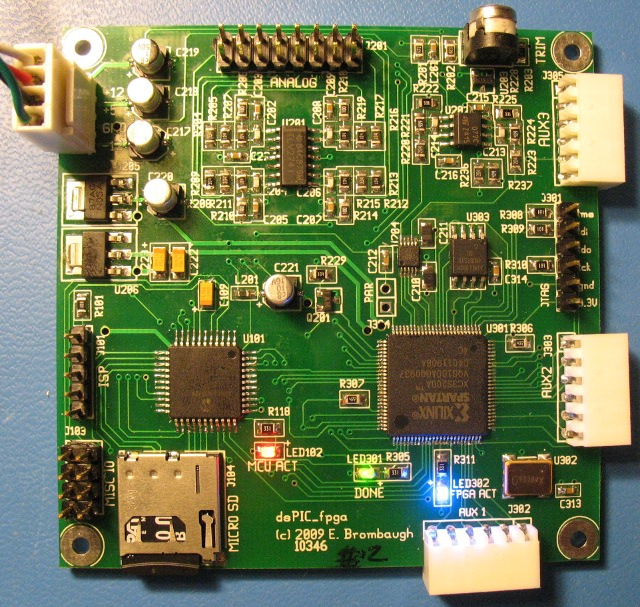

# dsPIC_FPGA
An FPGA audio sound generator

## What is it?
This is a small project focused on CV-based signal generation using the
Microchip dsPIC and a mid-range Xilinx Spartan 3A FPGA. It provides the
following features:

* Microchip <a href="http://www.microchip.com/wwwproducts/Devices.aspx?dDocName=en532297">dsPIC33FJ128GP204</a> Microcontroller with 128kB Flash, 16kB SRAM, ADC, Codec interface, I2C, SPI, etc.
* Xilinx <a href="http://www.xilinx.com/products/spartan3a/">XC3S200AVQ100</a> Spartan 3A FPGA with 200kgates, 16 Multipliers and 288kb RAM.
* Cirrus Logic <a href="http://www.cirrus.com/en/products/pro/detail/P1050.html">CS4344</a> stereo audio DAC with up to 192kHz / 24-bit sampling.
* Atmel <a href="http://www.atmel.com/dyn/products/product_card.asp?part_id=3818">AT45DB321D</a> SPI 32Mb Flash.
* Micro SD flash memory socket.
* Off board analog/control port with:
	* stereo audio output (+/-5Vpp, DC-coupled).
	* 4 x 10V CV + offset pot inputs.
	* 3 x 3.3V logic inputs to FPGA.
	* 1 x wide-range buffered logic input to FPGA>
* Off board digital expansion port with 6 MCU I/O.
* 3 x Digilent-compatible I/O ports with 4 FPGA I/O, 3.3V and GND.
* ISP port for MCU development and debugging.
* JTAG port for FPGA development and debugging.
* +12V, +5V, GND, -12V power connector.

## More
This is the final source for a project that was described in more detail here:
http://ebrombaugh.studionebula.com/synth/dsPIC_fpga/index.html